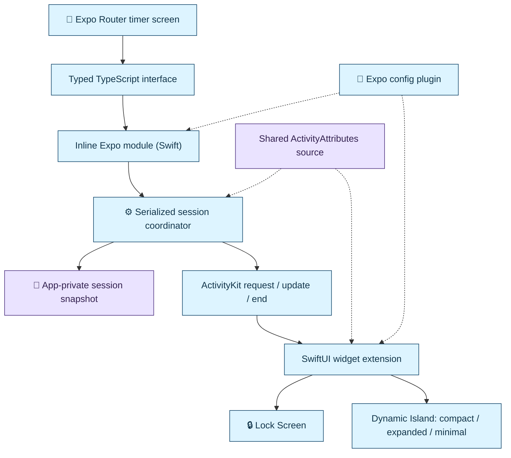
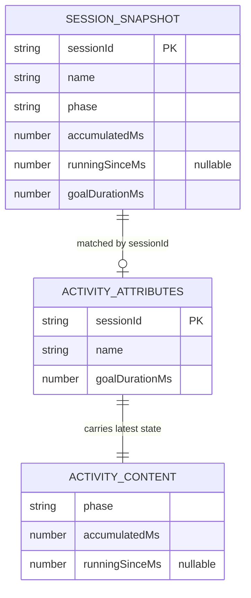
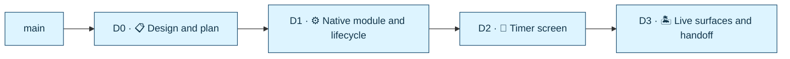

# Study timer implementation plan and Graphite stack

Status: planned, 2026-09-28. This deliverable decomposes [REQUIREMENTS.md](REQUIREMENTS.md); it does not claim the native module is built. Read [TECHNICAL_REQUIREMENTS.md](TECHNICAL_REQUIREMENTS.md) for the contract and the documented assumptions. Architecture, data relationships, lifecycle, and stack diagrams are embedded below.

## Delivery principle

Build in dependency order: fix the baseline, prove the native build path with a real activity, implement the lifecycle, connect the app, complete system presentation, then collect acceptance evidence. Every diff has one reviewable purpose and an explicit gate. The 2–3 hour target means correctness work is limited to what the requirements test; defensive machinery beyond that is cut. Document assumptions and real failures instead of presenting mock or preview output as native acceptance.

### Review decisions — 2026-09-28

Two adversarial reviews shaped this plan. Current decisions:

1. **Simple persistence.** One snapshot file, one write per transition, and that write is the commit point. No intent log, no stopping phase, no reset flow. Stop deletes the snapshot before ending activities, so a crash leaves only an orphan activity.
2. **One reconciliation rule.** At launch, foreground, and every Start: end every activity of this module's type that does not match the stored session. This is the zero-zombie guarantee.
3. **Corrupt storage is discarded** with a warning, after ending activities. A study timer does not justify a recovery UI.
4. **Native generates session IDs.** The activity's attributes carry the session ID, so no activity ID is persisted.
5. **Never auto-recreate a missing activity.** It may have been dismissed by the user; retry is explicit and in the foreground.
6. **Mirror ActivityKit's real API:** `request` throws; `update`/`end` do not. API completion is not proof of rendering.
7. **D1 requests a real activity from the module** and proves it renders in the extension, since the app and the extension compile the attributes into separate Swift modules.
8. **Fix the baseline first:** `expo-doctor` currently fails on duplicate packages, and `app.json` lacks `ios.bundleIdentifier`.
9. **Own config plugin** for the widget target, no `@bacons/apple-targets`; ask before adding it if the plugin blocks D1.
10. **Three implementation diffs**, and the default branch must contain the working app at submission.
11. **Inline Expo module** in `native/StudyTimer` instead of a `create-expo-module` package: no scaffold, podspec, rename, or autolinking step. Macro discovery is a D1 spike with a DSL fallback. See [Native build ownership](TECHNICAL_REQUIREMENTS.md#native-build-ownership) for the layout rules.

Platform limits the plan accepts (timer text format, Island width, minimal trigger, eight-hour limit, latency measurement) are listed in [Documented assumptions](TECHNICAL_REQUIREMENTS.md#documented-assumptions).

## Skills and delegation policy

Keep one lead responsible for the contract, integration, acceptance evidence, and Git/Graphite operations. Use bounded subagents when independent work materially improves delivery; do not create a separate chat for every phase. Preserve D1 → D2 → D3 delivery and their gates. D1's real native activity proof precedes substantial parallel implementation; later work can be prepared independently only against an established contract and cannot be accepted before its dependencies pass.

| Workstream               | Ownership                                                                                            | Skill guidance                                                                                                                                                                                                |
| ------------------------ | ---------------------------------------------------------------------------------------------------- | ------------------------------------------------------------------------------------------------------------------------------------------------------------------------------------------------------------- |
| Lead                     | Shared contract and configuration decisions, integration, stack operations, final verification       | Read this plan, `TECHNICAL_REQUIREMENTS.md`, and applicable `AGENTS.md` instructions before assigning work                                                                                                    |
| Native worker — D1       | Swift module, coordinator, store, config plugin, minimal widget, native tests, and native generation | Repository [write-swift](.agents/skills/write-swift/SKILL.md); Expo module, Swift concurrency, and Swift Testing skills when available                                                                        |
| React Native worker — D2 | Screen, hook, formatting, UI tests, and consumption of the agreed bridge                             | Repository [react-native-best-practices](.agents/skills/react-native-best-practices/SKILL.md) and [typescript-advanced-types](.agents/skills/typescript-advanced-types/SKILL.md), applied only where relevant |
| Presentation worker — D3 | Widget layouts and accessibility after explicit handoff of widget files from the native worker       | Repository `write-swift`; SwiftUI guidance when available                                                                                                                                                     |
| Independent reviewer     | Read-only audit of the integrated diff against requirements, including lifecycle races and test gaps | Relevant Swift concurrency, Swift Testing, SwiftUI, and repository skills; return evidence-backed findings to the lead                                                                                        |

Environment-provided skills are optional supplements, not checkout prerequisites. Read a selected skill before applying it; use current official documentation when a supplement is unavailable. Skills do not override the repository contract or authorize dependency additions, toolchain upgrades, or unrelated refactors. Check Swift guidance against the actual compiler, language mode, and build settings. Follow `AGENTS.md` for SDK-matched Expo documentation, and consult current Apple documentation for ActivityKit and WidgetKit behavior. Prefer simple bridge types and measured performance fixes over speculative abstractions or optimization.

### Spawn and integration boundaries

- Every assignment names the objective, dependency checkpoint, exact owned files, relevant skills and contract sections, required checks, and expected report. Reports include changed files, commands/results, blockers, and unverified behavior.
- Native remains the sole owner of authoritative timer state and persistence. React Native renders returned snapshots and derives display ticks; it must not introduce a second persisted timer.
- The lead assigns one writer for each shared file, including `app.json`, `package.json`, `bun.lock`, plugin/module registration, and TypeScript bridge types. Workers report needed contract changes to the lead before editing outside their boundary.
- Subagents share the checkout by default. Use explicit managed worktrees and assign their paths when isolation is needed; spawning alone does not isolate files. Preserve the agreed baseline and let the lead integrate completed changes into the planned stack.
- Assign one owner at a time for native generation, simulator installation, and interactive acceptance. Worktrees do not isolate the simulator. Avoid concurrent Git/Graphite mutations in a shared checkout.
- The lead waits for required results, inspects the actual patches, and runs the relevant integration gates. Use a fresh review context after integration, then fix substantiated findings and rerun affected checks. Distinguish static/test/build evidence from observed simulator behavior; retain the final human demo.

### Model and reasoning defaults

Inherit the lead's model and reasoning effort for subagents; omit per-spawn overrides. Do not tune models as part of this implementation. If the user later approves a role-specific model/effort policy, record it here and apply it consistently to subsequent spawns. Report any runtime configuration that prevents the requested settings rather than silently substituting them.

### Project-local pstack policy

The installed pstack skills support the existing D1 → D2 → D3 workflow; they do not add implementation phases or change the technical contract. Apply the following project overrides whenever using them, and include these overrides in delegated task instructions:

- Every pstack role uses `inherit-parent`, including implementation, exploration, synthesis, and review. Omit both model and reasoning overrides when spawning. Do not adopt bundled Claude/Grok defaults or silently substitute models.
- Keep configuration in this project policy. Do not run `setup-pstack`'s global-writing flow or create/update `~/.agents/pstack-models.md` or Cursor rules as part of this implementation. Existing global pstack preferences must not replace this project's explicit defaults.
- Default to one independent reviewer per completed implementation diff. For an explicitly requested multi-reviewer panel, name its bounded size and independent review questions before spawning; repeated `inherit-parent` entries still create separate agents. Same-model reviews provide independent contexts, not cross-model evidence.
- Apply domain modeling, boundary discipline, and idempotency guidance to the native lifecycle. Use behavior-focused tests and actual simulator evidence at the existing gates. Use `interrogate` for the independent review and `unslop` for final code/documentation cleanup, without expanding scope or rewriting imported skills.
- `poteto-mode`, broad swarms, model tuning, and automatic shipping remain opt-in. Installing skills does not activate these workflows or authorize external messages, publication, or merging. Existing explicit Git/Graphite authorization still governs stack operations.
- After D1 establishes working native build and simulator commands, consider a project-local verification skill only if it makes the proven acceptance steps repeatable. Base it on commands and outcomes actually verified; do not make generating another skill a prerequisite for D1 or claim automation replaces the human demo.

No additional installation or global model setup is required to implement this plan under these overrides.

## State and persistence choice

Use **one versioned JSON file written by the native Swift module** for the active session, implemented through Foundation in `StudyTimerStore.swift`. We do not need a JavaScript filesystem dependency for a file whose only reader and writer is native code. Keep it behind a small store interface so the storage implementation can change without changing the bridge or UI.

| State                                    | Owner and storage                               | Lifetime                                                      |
| ---------------------------------------- | ----------------------------------------------- | ------------------------------------------------------------- |
| Name input, pending action, inline error | React component/hook state                      | Current screen; not persisted                                 |
| Active session                           | Swift coordinator + app-private JSON file       | Survives process termination and relaunch                     |
| Snapshot displayed by React              | In-memory copy returned by the module           | Reload at launch, on foreground, and after uncoded rejections |
| Lock Screen / Dynamic Island content     | ActivityKit content supplied by the coordinator | Managed by iOS; reconciled against the stored session         |
| Elapsed display ticks                    | Derived from timestamps on each surface         | Never written every second                                    |

### Why this storage option

| Option                 | Fit                                                              | Decision for this challenge                                        |
| ---------------------- | ---------------------------------------------------------------- | ------------------------------------------------------------------ |
| Native Foundation file | A single small snapshot with native ownership; no new dependency | **Use now**                                                        |
| `expo-file-system`     | File operations exposed to JavaScript                            | Useful for JS-owned files; keep active-session writes inside Swift |
| `expo-sqlite`          | Persistent structured records, queries, and transactions         | Revisit for session history, daily totals, or reporting            |
| `react-native-mmkv`    | Synchronous key/value storage, such as preferences               | Defer; no workload justifies another native dependency             |

The deciding factor is who owns the write. A separate persisted timer copy in JS would need reconciliation with the native snapshot. No storage engine can make an ActivityKit call and a write atomic, which is why reconciliation, not transactions, provides correctness.

References: [Expo SQLite](https://docs.expo.dev/versions/v58.0.0/sdk/sqlite/), [Expo FileSystem](https://docs.expo.dev/versions/v58.0.0/sdk/filesystem/), [React Native MMKV](https://github.com/margelo/react-native-mmkv), and [Foundation atomic writes](https://developer.apple.com/documentation/foundation/nsdata/writingoptions/atomic).

### Storage work in D1

- Store `session.json` under the app's Application Support `StudyTimer` directory, not a cache or temporary directory.
- Encode `{ schemaVersion: 1, session }`. Replace the whole file atomically on transitions; no per-second writes.
- Missing file means idle. Invalid JSON or an unsupported schema is discarded after ending activities, returning `SESSION_DISCARDED`. An I/O read failure rejects with `PERSISTENCE_FAILED` and deletes nothing.
- Test the real file store in a temporary directory: round trip, missing file, corrupt data, unsupported schema, and a failed write.

## Proposed stack

Each branch is based on the preceding branch. All D1–D3 paths are proposed; they do not exist yet.

| Diff / branch                       | Parent | Commit / PR title                                                   | Scope                                                                            | Gate                                                                                     |
| ----------------------------------- | ------ | ------------------------------------------------------------------- | -------------------------------------------------------------------------------- | ---------------------------------------------------------------------------------------- |
| D0 `docs/study-timer-plan`          | `main` | `docs: define study timer architecture and delivery stack`          | Requirements, plan, contract, diagrams, README links                             | Requirement coverage, links, Mermaid render                                              |
| D1 `feat/study-timer-native`        | D0     | `feat: add study timer native module, widget target, and lifecycle` | Baseline fix, module, plugin, minimal extension, coordinator, store, Swift tests | Checkpoint A (real activity renders), then Checkpoint B (lifecycle tests + native smoke) |
| D2 `feat/study-timer-screen`        | D1     | `feat: connect timer controls to native session state`              | Real screen, warnings, foreground reconciliation                                 | Typecheck/lint; simulator interaction                                                    |
| D3 `feat/study-timer-live-surfaces` | D2     | `feat: complete Live Activity views and document the demo`          | Four presentations, goal ring, accessibility, acceptance doc, README runbook     | Visual/timing acceptance; clean-setup walkthrough                                        |

Do not create empty placeholder branches. Each branch should compile and keep the functionality below it. If a gate finds a defect, fix the owning diff and restack descendants. Each diff updates the "Current completion" line at the end of this file so the docs never overstate progress.

## Implementation diagrams

### Native module architecture

The app controls the session through a typed bridge. Native code owns durable timer state; the separate widget extension renders ActivityKit content.



### Session and activity data relationships

This is a logical data model, not a relational schema. The snapshot is app-private JSON; ActivityKit holds attributes and the latest content. The session ID in the attributes is the only link between them. Zero or one activity is the steady state; reconciliation ends any other.



### Session lifecycle and reconciliation

Commands are serialized through completion. A failed activity request leaves a running local timer with an `unavailable` status. Unconfirmed cleanup leaves an orphan that the next reconciliation ends.

```mermaid
flowchart TD
    Idle["⏹ Idle"] -->|"Start: end orphans, persist, request activity"| Running["▶ Running"]
    Running -->|"Pause: persist elapsed, update activity"| Paused["⏸ Paused"]
    Paused -->|"Resume: persist new anchor, update activity"| Running
    Running -->|"Stop: delete snapshot, end activities"| Idle
    Paused -->|"Stop: delete snapshot, end activities"| Idle
    Running -.->|Background or termination| OS["iOS renders last content"]
    Paused -.->|Background or termination| OS
    OS -->|App opens| Reconcile["Load snapshot; end non-matching activities"]
    Reconcile -->|Running snapshot| Running
    Reconcile -->|Paused snapshot| Paused
    Reconcile -->|"No snapshot, or corrupt snapshot discarded"| Idle
    classDef normal fill:#DCFCE7,stroke:#166534,color:#14532D
    classDef pending fill:#FEF3C7,stroke:#92400E,color:#78350F
    class Idle,Running,Paused,OS normal
    class Reconcile pending
```



### Stack dependency order

Each completed diff is created above its parent. Branches are created only when their implementation and verification are ready.



## D0 — Design and review boundaries

Publish the original requirements alongside these design documents so relative links work. `REQUIREMENTS.md` stays as the challenge text; links to the design documents live in the root README. Add `TECHNICAL_REQUIREMENTS.md` and `IMPLEMENTATION_PLAN.md`, including the embedded diagrams.

Review the one-session rule, native ownership, count-up behavior, the documented assumptions, and failure semantics before implementation. This diff changes documentation only.

## D1 — Native module, widget target, and lifecycle

### Step zero: baseline

1. From the repository root, run `bunx expo-doctor`. At planning time it fails on duplicate copies of `expo`, `expo-constants`, `expo-font`, `expo-glass-effect`, `expo-linking`, `@expo/dom-webview`, and `@expo/log-box`.
2. Follow its advice: delete every `node_modules` folder in the workspace and run `bun install` from the root. If duplicates persist, regenerate `bun.lock` and review the lockfile diff. Run `bunx expo install --check` for version ranges. Rerun `expo-doctor` until it passes, and confirm only one `react-native` version remains installed. Record any peer warning that is accepted (for example, the `react-native-worklets` range).
3. Set `ios.bundleIdentifier` in `app.json`; the extension uses `<app id>.StudyTimerWidget`.
4. Build and launch the untouched starter with `bunx expo run:ios` on a Dynamic Island simulator. Record the SDK, Xcode, simulator, and commands. Any later build failure is then attributable to our changes.

### Checkpoint A: a real activity renders

File layout for this checkpoint is defined in [Native build ownership](TECHNICAL_REQUIREMENTS.md#native-build-ownership).

1. Enable inline modules: set `experiments.inlineModules.watchedDirectories` to `["native/StudyTimer"]` in `app.json`.
2. **Macro discovery spike.** Add `native/StudyTimer/StudyTimerModule.swift` using `@ExpoModule` with one async `@JS` method, plus an empty `func definition() -> ModuleDefinition { ModuleDefinition {} }` so inline discovery registers it. Run `bunx expo prebuild`, build, and call it from JS with `requireNativeModule('StudyTimerModule')`. If it does not register or the macro fails, record the exact error and rewrite the module with DSL `AsyncFunction`s inside `definition()`. Either way, the TypeScript facade in `src/features/study-timer` is the only JS entry point.
3. Add `native/Shared/StudyTimerAttributes.swift` and a minimal `start`/`stop` in the module that calls `Activity.request` and `end`. These become the real methods, not temporary fixtures.
4. Add `widgets/study-timer/StudyTimerLiveActivity.swift` and a widget bundle with a minimal `ActivityConfiguration` using `Text(timerInterval:pauseTime:countsDown:)`.
5. Implement `plugins/with-study-timer.js` with SDK-compatible config APIs: extension target, widget sources, `StudyTimerAttributes.swift` membership in both the app and the widget target, embed phase, identifiers, deployment target (at least iOS 16.2), and `NSSupportsLiveActivities`. Wire it in `app.json` and add a native-build script (prebuild, then `expo run:ios`) separate from Metro startup.
6. Create `native/Package.swift` with a core target at `StudyTimer/Core` and a first timer-math test in `Tests/StudyTimerCoreTests`.

Gate A:

- An activity requested from the module appears on the simulator Lock Screen and Dynamic Island, with ticking running text and frozen paused text, including a long-duration value.
- The macro-or-DSL outcome of the discovery spike is recorded.
- Regenerating twice in a disposable checkout yields one extension target, one embed entry, one synchronized folder on the app target, and the attributes file in both targets exactly once.
- No test file or `Package.swift` is compiled into the app target.
- `swift test --package-path native` passes.
- The minimal-presentation trigger is tried and the result recorded.

Stop and resolve integration failures here before building the lifecycle.

### Checkpoint B: lifecycle

Implement the contract from the technical design: coordinator, store, and timer math in `native/StudyTimer/Core`; the bridge and ActivityKit adapter in `native/StudyTimer` outside the core; `src/features/study-timer/study-timer.types.ts` plus an iOS binding and a non-iOS stub selected by platform file extension.

- FIFO async command queue with an injected clock, store, and ActivityKit adapter.
- Transition ordering, reconciliation, and warnings exactly as specified in [Persistence and reconciliation](TECHNICAL_REQUIREMENTS.md#persistence-and-reconciliation).
- Validate native input even when TypeScript types appear to prevent invalid calls.

Tests with controlled adapters: elapsed math and clamping; idempotent Pause/Resume/Stop; `SESSION_CONFLICT` and `STALE_SESSION`; rapid Start/Stop interleaving leaves no nonterminal activity; crash after Start's write but before the request reports `missing`; crash after Stop's delete but before `end` is cleaned up by reconciliation; a surviving match is adopted without duplication; corrupt and unsupported snapshots are discarded after ending activities; the store cases listed above.

Gate B: Swift tests pass, TypeScript contract checks pass, and a simulator smoke run exercises start, pause, resume, and stop against the real extension. A passing mock does not substitute for ActivityKit interaction.

## D2 — Connect the React Native timer

Proposed owners: `src/app/index.tsx`, `src/features/study-timer/use-study-timer.ts`, `timer-format.ts`, and feature components. Remove or adjust starter navigation only where needed for this screen.

Add a custom-name form, HH:MM:SS elapsed display, Pause/Resume, Stop, and Start New Session when idle. Render native-returned snapshots; UI ticks are presentation only. Disable controls while a command is pending. Show validation errors inline. For `PERSISTENCE_FAILED` or uncoded rejections, refresh with `getSession` before showing state. Show warnings (`unavailable`, `missing`, discarded session, unconfirmed cleanup) next to the snapshot they came with, with Retry for a missing or unavailable activity. Fetch capabilities and session at launch and on return to foreground. Unsupported platforms render a message without importing the iOS module.

Gate: typecheck/lint, focused formatting tests, and real simulator input. Verify blank and long names, repeated taps, keyboard dismissal, loading and error states, accessibility labels, foreground reconciliation, and Retry. No optimistic state: the screen changes only when a native result arrives.

## D3 — Live surfaces and reviewer handoff

Extend the widget: Lock Screen name and elapsed; compact truncated name plus time; expanded full bounded name, time, and goal ring; minimal elapsed. Use the system timer text with explicit frames in compact and minimal regions. Keep a clear paused indicator and ensure the goal ring does not imply a countdown.

Add `docs/acceptance/study-timer.md` with environment, steps, expected and observed results, and evidence paths. Update the root README with commands an unfamiliar reviewer (or an LLM) can run non-interactively: prerequisites, install, `expo-doctor`, custom native build, Metro, simulator selection, plugin regeneration, troubleshooting, and test commands. Never describe the web export command as an iOS build.

Run this demo and record pass/fail:

1. Start "Chapter 5 Review"; observe name and ticking time in the app and on the Lock Screen.
2. Pause for 10 seconds; both surfaces stay frozen. Resume; no paused time is added. Measure propagation from a screen recording.
3. Inspect compact, expanded, and minimal Dynamic Island layouts and the goal ring, with long-name and long-duration fixtures.
4. Background and lock for 60 seconds; return and compare elapsed time.
5. Force quit while running and while paused; inspect the activity and reconciliation on relaunch.
6. Rapid Start/Stop repeatedly; after the final Stop, verify no activity remains and the system view disappears.
7. Disable Live Activities; start a timer and verify the honest `unavailable` status. Dismiss the activity from the Lock Screen and verify `missing` plus explicit Retry.
8. Stop from running and paused states; a new session starts cleanly.

List the controlled-adapter regressions from D1 separately from simulator observations. Do not describe injected observations as simulator evidence.

Include brief discussion notes on architecture, the hardest integration issue, improvements, and actual AI mistakes caught during implementation. Leave those notes pending until evidence exists.

## Submission

Reviewers clone the default branch, so it must contain the complete working app. After the stack passes its gates and the user approves, merge it into `main` bottom-up; publishing PRs alone does not satisfy submission. Merging needs explicit approval.

## Graphite MCP: create and publish each completed diff

The MCP tools `mcp__graphite__learn_gt` and `mcp__graphite__run_gt_cmd` are available. A read-only `gt log short` shows only `main`. There is currently no remote; publishing cannot proceed until the intended GitHub repository is identified and configured.

For each completed slice:

1. Confirm the current branch is its planned parent and inspect `git status --short`. Preserve unrelated edits and any pre-existing staged work.
2. Write the slice, run its gate, and inspect the actual patch.
3. Stage only its explicit files. Audit `git diff --cached --name-status`, `git diff --cached --stat`, and `git diff --cached --check`. Do not use broad staging flags.
4. Create the stacked diff through Graphite MCP. Example for D0:

```json
{
  "cwd": "/Users/benjaminschachter/boldvoice-interview",
  "args": [
    "create",
    "docs/study-timer-plan",
    "--message",
    "docs: define study timer architecture and delivery stack",
    "--no-interactive"
  ],
  "why": "Create the reviewed documentation diff above main"
}
```

5. Confirm the new branch's parent and commit file boundary.
6. Once the remote and Graphite setup are confirmed, publish completed branches (this pushes the current branch and its ancestors):

```json
{
  "cwd": "/Users/benjaminschachter/boldvoice-interview",
  "args": ["submit", "--no-interactive"],
  "why": "Publish completed study timer diffs for review"
}
```

7. Verify each PR's base and report actual links, validation, and remaining gates. Do not mark planned slices as published.

Use `gt create` rather than `git commit`, and `gt submit` rather than `git push`. For feedback, stage only the correction, use `gt modify`, restack descendants as necessary, rerun affected checks, and resubmit. Do not run a broad `gt sync` over unrelated branches.

## Timebox and stopping rules

The challenge suggests 2–3 hours. Treat that as a target, not proof that native tooling will cooperate. Prioritize D1's Checkpoint A over everything else, then the lifecycle, then styling. Do not cut Dynamic Island or zombie handling and still claim all requirements passed. Log build and tooling delays separately. Defer themes, analytics, history, cloud sync, and lock-screen controls.

Current completion: documentation authored; baseline fix, implementation, native tests and build, simulator acceptance, branch creation, and publication are pending.
